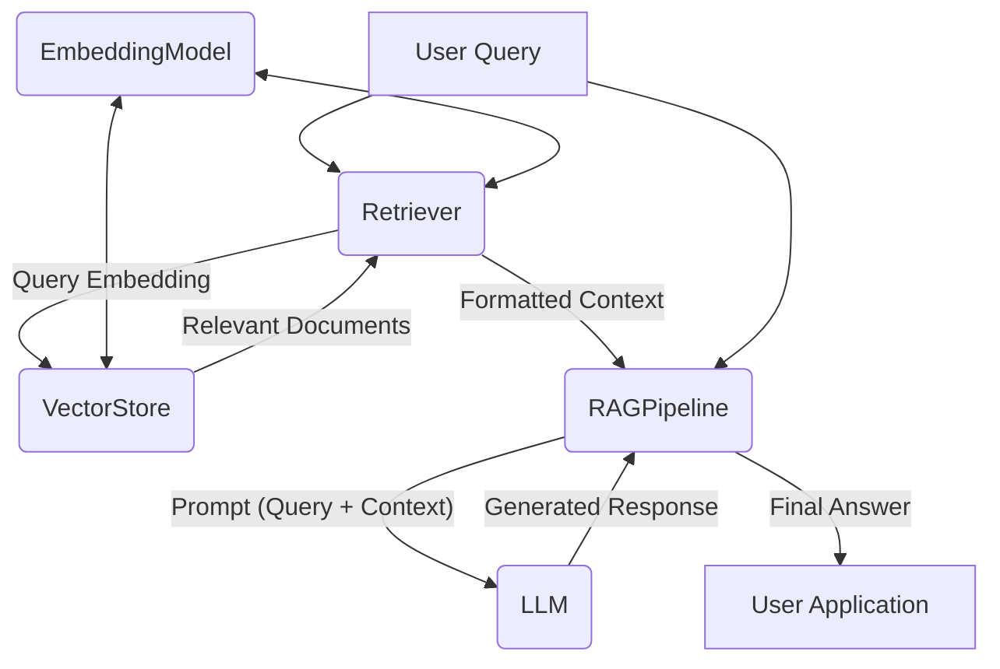

## Architecture

This document outlines the architecture of the Data Pipeline and RAG SDK, considering the perspectives of an Architect, a Coder, and a Project Manager.

### 1. Architect's Perspective

#### 1.1. Overview

The Data Pipeline project encompasses a Data Pipeline for ingesting, processing, and embedding web content, and a Retrieval-Augmented Generation (RAG) SDK for building applications that leverage this processed data with Large Language Models (LLMs). The system prioritizes modularity, scalability, and maintainability, enabling flexible deployment and extension.

##### Overall System Architecture Diagram

```mermaid
graph LR
    subgraph "Data Pipeline System"
        DI[Data Ingestion Module]
        CP[Content Processing & Extraction Module]
        EG[Embedding Generation Module]
        VSM[Vector Storage Module]
        RM[Retrieval Module]
        LLMI[Language Model Interaction Module]
        RAG[RAG Orchestration Module]
        OS[Operational Scripts]
    end

    subgraph "External Systems"
        WebSrc[Web Content / URLs]
        OpenAIAPI[OpenAI API]
        DB[Vector DB (AstraDB / In-Memory)]
        App[User Application]
    end

    WebSrc --> DI;
    DI --> CP;
    CP --> EG;
    EG -- Uses --> OpenAIAPI;
    EG --> VSM;
    VSM -- Interacts with --> DB;
    RM --> VSM;
    RM -- Query Embedding via --> EG;
    LLMI -- Uses --> OpenAIAPI;
    RAG --> RM;
    RAG --> LLMI;
    RAG --> App;
    OS -- Manages --> VSM;
    OS -- Triggers --> DI;
    OS -- Triggers --> CP;
    OS -- Triggers --> EG;
```

#### 1.2. System Components

1.  **Data Ingestion Module (Primarily in Scripts & `DataLoader` class):**
    *   **Responsibilities:** Fetches raw data from specified URLs (e.g., text files, web pages).
    *   **Technologies:** Utilizes libraries like `axios` (in `reset.ts`) or `Puppeteer` (via LangChain's `PuppeteerWebBaseLoader` in `seed.ts`, `update.ts`) for dynamic content rendering or complex web scraping scenarios.
    *   **Configuration:** Source URLs are managed via the `.env` file (`URLS_TO_PROCESS`) or hardcoded in scripts for specific tasks.

2.  **Content Processing & Extraction Module (In Scripts & `DataLoader`):
    *   **Responsibilities:** Parses raw ingested data (HTML, text), extracts relevant content, cleans it, and chunks it into manageable pieces.
    *   **Technologies:** Standard string manipulation, HTML parsing (e.g., `jsdom` in `reset.ts`, or Puppeteer's DOM access), text splitting (LangChain's `RecursiveCharacterTextSplitter` or custom logic).

3.  **Embedding Generation Module (In `OpenAIEmbeddingAdapter`, `LLM` class, and `VectorStore` class):**
    *   **Responsibilities:** Takes processed text chunks and generates vector embeddings using a specified model (e.g., OpenAI).
    *   **Technologies:** Interacts with the OpenAI API (e.g., `text-embedding-3-small`). The `EmbeddingModel` interface in `vector-store.ts` and its implementations (like `OpenAIEmbeddingAdapter` in `reset.ts`/`test.ts`) handle this.
    *   **Key Management:** API keys (`OPENAI_API_KEY`) are managed via the `.env` file and passed to relevant classes/functions.
    *   **Similarity Calculation:** Embeddings are used to calculate similarity scores between documents and queries, which are crucial for relevance filtering.

4.  **Vector Storage Module (`VectorStore` class):**
    *   **Responsibilities:** Stores the processed data (text chunks) and their corresponding vector embeddings. Provides an interface for adding documents and performing similarity searches with similarity scores.
    *   **Technologies:** Supports multiple backends, currently DataStax AstraDB and an in-memory store. Configured via `VectorStoreConfig`.
    *   **Similarity Search:** Implements robust similarity search with error handling and debugging capabilities, particularly for the AstraDB provider. Returns documents with their similarity scores for relevance filtering.

5.  **Retrieval Module (`Retriever` class):**
    *   **Responsibilities:** Takes a query, embeds it, and retrieves the most relevant documents from the `VectorStore`. Filters results based on similarity threshold to ensure only truly relevant documents are returned.
    *   **Technologies:** Uses an `EmbeddingModel` for query embedding and interacts with the `VectorStore`.
    *   **Relevance Filtering:** Implements similarity threshold filtering to exclude documents with low semantic similarity to the query, preventing irrelevant information from being included in responses.

6.  **Language Model Interaction Module (`LLM` class):**
    *   **Responsibilities:** Sends a prompt (often augmented with retrieved context) to an LLM and receives a generated response.
    *   **Technologies:** Interacts with LLM provider APIs (e.g., OpenAI).

7.  **RAG Orchestration Module (`RAGPipeline` class):**
    *   **Responsibilities:** Coordinates the overall RAG flow: retrieving relevant documents based on a query, constructing a prompt with this context, and generating a final response using an LLM.
    *   **Technologies:** Integrates `Retriever`, `LLM`, and potentially `DataLoader` and `VectorStore` components.
    *   **Configuration:** Provides configuration options like `retrieverSimilarityThreshold` to control the relevance filtering behavior, allowing fine-tuning for different use cases and query types.

8.  **Operational Scripts (`src/scripts`):**
    *   **Responsibilities:** Provide command-line utilities for database lifecycle management (seeding, updating, resetting data) and for testing the SDK components.

##### Data Ingestion and Processing Flow Diagram

```mermaid
graph TD
    A[Source URLs (.env / Scripts)] --> B(Data Ingestion Module);
    B -- Raw Data (HTML, Text) --> C(Content Processing & Extraction Module);
    C -- Cleaned, Chunked Text --> D(Embedding Generation Module);
    D -- Text Chunks for Embedding --> E[OpenAI API];
    E -- Vector Embeddings --> D;
    D -- Processed Documents (Text Chunks + Embeddings) --> F(Vector Storage Module);
    F -- Stores Data --> G[Vector Database (AstraDB / In-Memory)];
```

#### 1.3. Data Flow (RAG Query)



#### 1.4. Non-Functional Requirements

*   **Scalability:** The system should handle increasing numbers of documents and queries. Vector database choice (AstraDB) and modular SDK design support this.
*   **Reliability:** Robust error handling in API interactions and data processing steps.
*   **Maintainability:** Code is structured into classes and modules with clear responsibilities. TypeScript enhances maintainability.
*   **Configurability:** Key parameters (API keys, model names, database details) are managed via `.env` files and configuration objects.
*   **Security:** API keys and sensitive data handled via environment variables, not hardcoded.

### 2. Coder's Perspective

#### 2.1. Project Structure (Illustrative)

```text
/data-pipeline
|-- /src
|   |-- /classes                # Core SDK classes
|   |   |-- data-loader.ts
|   |   |-- llm.ts
|   |   |-- pipeline.ts
|   |   |-- retriever.ts
|   |   |-- vector-store.ts
|   |   |-- index.ts            # Barrel file for classes
|   |-- /scripts                # Operational CLI scripts
|   |   |-- reset.ts
|   |   |-- seed.ts
|   |   |-- test.ts
|   |   |-- update.ts
|   |   |-- index.ts           # Barrel file for scripts
|   |-- index.ts               # Main SDK entry point
|-- .env
|-- .env.example
|-- package.json
|-- tsconfig.json
|-- ARCHITECTURE.md
|-- README.md
```

Detailed descriptions of the core modules, classes, and scripts are provided below.

#### 2.1.1. Core SDK Components (`src/classes`)

This directory contains the core building blocks of the RAG SDK.

*   **`data-loader.ts`**
    *   **`DataLoader` class:** Placeholder for loading data from various sources. (Current implementation is minimal).
    *   **`RagDocument` interface:** Defines the standardized structure for a piece of processed data (ID, content, metadata, optional embedding, and optional similarity score). The similarity property is crucial for relevance filtering in the retrieval process.
    *   **`DataSourceConfig` interface:** Configuration for data sources (type, path, URL).

*   **`llm.ts`**
    *   **`LLM` class:** Abstraction for interacting with LLMs (e.g., OpenAI). Handles prompt generation, API requests, and response parsing. Supports streaming.
    *   **`LLMConfig` type (e.g., `OpenAIConfig`):** Configuration for LLMs (provider, model, API key, temperature).
    *   **`LLMResponse` interface:** Standardized format for LLM responses (text, metadata).

*   **`vector-store.ts`**
    *   **`VectorStore` class:** Manages storage and retrieval of vector embeddings. Supports in-memory and AstraDB backends. Handles document addition (embedding if needed) and similarity search.
    *   **`EmbeddingModel` interface:** Contract for embedding models (name, dimensions, `generateEmbeddings` method).
    *   **`VectorStoreConfig` type (e.g., `InMemoryStoreConfig`, `AstraDBStoreConfig`):** Configuration for vector stores.
    *   **`PlaceholderEmbeddingModel` class:** A fallback/dummy embedding model for testing or when a real one isn't configured.

*   **`retriever.ts`**
    *   **`Retriever` class:** Embeds queries using an `EmbeddingModel` and retrieves relevant documents from the `VectorStore` (top-K results). Formats retrieved documents into a context string. Implements similarity threshold filtering to exclude irrelevant documents based on their similarity scores.
    *   **`RetrieverConfig` interface:** Configuration (VectorStore, EmbeddingModel, topK, similarityThreshold).

*   **`pipeline.ts`**
    *   **`RAGPipeline` class:** Orchestrates the RAG flow: uses `Retriever` to get context, constructs a prompt, and uses `LLM` to generate a response. Can optionally use `DataLoader` for ingestion. Handles cases where no relevant documents are found by returning an appropriate response.
    *   **`RAGPipelineConfig` interface:** Configuration (VectorStore, Retriever's EmbeddingModel, LLM, optional DataLoader, topK, prompt template, retrieverSimilarityThreshold).

*   **`index.ts` (in `src/classes`)**
    *   Barrel file re-exporting all core classes and interfaces from this directory.

#### 2.1.2. Utility and Operational Scripts (`src/scripts`)

These scripts provide CLI tools for data pipeline management and testing.

*   **`seed.ts`**
    *   **Purpose:** Populates AstraDB with initial data scraped from URLs. Uses `PuppeteerWebBaseLoader` for scraping and `RecursiveCharacterTextSplitter` for chunking.
    *   **Key Functions:** `createCollection`, `scrapePage`, `loadSampleData`.
    *   **Note:** The import `langchain/text_splitter` was the subject of the original user query and was updated to `@langchain/textsplitters` (assuming the package was installed).

*   **`update.ts`**
    *   **Purpose:** Adds new data from specified URLs to an existing AstraDB collection.
    *   **Key Functions:** `scrapePage`, `splitText`, `updateDatabase`.

*   **`reset.ts`**
    *   **Purpose:** Clears and re-seeds the AstraDB collection. Contains its own `OpenAIEmbeddingAdapter` and helper functions for fetching (`axios`), extracting (`jsdom`), and chunking text.
    *   **Key Components:** `OpenAIEmbeddingAdapter` class, `fetchHtmlContent`, `extractTextFromHtml`, `chunkText`, `main` orchestration logic.

*   **`test.ts`**
    *   **Purpose:** Integration test for the RAG SDK. Demonstrates pipeline usage with `OpenAIEmbeddingAdapter`, `LLM` (OpenAI), and `VectorStore` (AstraDB).
    *   **Key Components:** `OpenAIEmbeddingAdapter` class, `TestLLMResponse` interface, `main` test orchestration.

*   **`index.ts` (in `src/scripts`)**
    *   Barrel file re-exporting runnable scripts.

#### 2.1.3. Main SDK Entry Point (`src`)

*   **`index.ts` (in `src`)**
    *   **Purpose:** Main entry point for the RAG SDK package. Exports key classes, interfaces, and utility functions for SDK consumers.
    *   **Key Exports:** Re-exports from `./classes` and `./scripts` (selectively). Includes a `version` constant and `helloSDK` example function.

#### 2.2. Key Technologies & Libraries

*   **Language:** TypeScript
*   **Runtime:** Node.js
*   **Package Manager:** pnpm
*   **HTTP Requests:** `axios` (in `reset.ts`), Puppeteer's internal mechanisms.
*   **Web Scraping/Dynamic Content:** `Puppeteer` (via `@langchain/community/document_loaders/web/puppeteer`), `jsdom` (in `reset.ts`).
*   **Text Splitting:** `@langchain/textsplitters` (`RecursiveCharacterTextSplitter`), custom logic in `reset.ts`.
*   **AI Embeddings & LLM:** `openai` library.
*   **Vector Database Client:** `@datastax/astra-db-ts`.
*   **Environment Variables:** `dotenv`.

#### 2.3. Development Practices

*   **Modularity:** Core logic in `src/classes`, operational tasks in `src/scripts`.
*   **Type Safety:** Extensive use of TypeScript interfaces and types.
*   **Error Handling:** Try-catch blocks for I/O and API calls; scripts exit on critical errors.
*   **Logging:** Console-based logging for progress and diagnostics.
*   **Environment Configuration:** `.env` for secrets and configurations, validated by scripts.
*   **Async/Await:** Standard for asynchronous operations.

#### 2.4. API Interaction (OpenAI)

*   Handled by the `openai` npm package, encapsulated within `LLM` and `OpenAIEmbeddingAdapter` classes.

### 3. Project Manager's Perspective

#### 3.1. Project Goal

Develop a robust RAG SDK and associated data pipeline tools to automate fetching, processing, embedding web content, and enabling LLM-based applications to query this data.

#### 3.2. Scope

*   **In Scope:**
    *   RAG SDK classes (`DataLoader`, `VectorStore`, `LLM`, `Retriever`, `RAGPipeline`).
    *   OpenAI integration for embeddings & LLM.
    *   AstraDB and in-memory support for `VectorStore`.
    *   Scripts for data management (seed, update, reset) using Puppeteer/LangChain for scraping.
    *   Configuration via `.env`.
*   **Out of Scope (Initial):**
    *   Advanced workflow engines, UI, real-time processing, complex transformations beyond standard chunking, extensive multi-provider support for LLMs/VectorDBs.

#### 3.3. Key Deliverables

1.  Functional RAG SDK (`src/classes`, `src/index.ts`).
2.  Operational scripts (`src/scripts`).
3.  `README.md` (setup, usage).
4.  `ARCHITECTURE.md` (this document).
5.  `.env.example`.
6.  Integration test script (`test.ts`).

#### 3.4. Milestones (Illustrative)

*   **M1: Core SDK Classes:** Foundational classes (`Document`, `EmbeddingModel`, `VectorStore` [in-memory], `LLM` [OpenAI]).
*   **M2: Data Ingestion & Scripts:** `seed.ts`, `update.ts` with URL fetching, text splitting, OpenAI embedding.
*   **M3: AstraDB Integration:** Full AstraDB support in `VectorStore` and scripts.
*   **M4: RAG Orchestration:** `Retriever`, `RAGPipeline` classes; `test.ts` integration test.
*   **M5: Documentation & Refinement:** Complete `README.md`, `ARCHITECTURE.md`, refine error handling and logging.

#### 3.5. Assumptions & Dependencies

*   Access to OpenAI API and DataStax AstraDB with valid credentials.
*   Accessible target URLs.
*   Node.js, pnpm, TypeScript environment.

#### 3.6. Risk Management

*   **API Changes:** Encapsulate external API logic to simplify updates.
*   **Website Structure Changes:** Robust selectors for scraping; error handling.
*   **Rate Limiting:** Implement retry/backoff for API calls.
*   **Security:** Secure handling of API keys via `.env`.
*   **Dependency Updates:** Monitor LangChain and other AI library changes.

### 4. Non-Technical Summary

Imagine you want to build a smart assistant that can answer questions based on a specific set of documents or websites, not just general internet knowledge. The Data Pipeline project provides the tools to do exactly that.

**What does this do?**

1.  **Gathers Information:** This can automatically collect information from web pages or documents you tell it to look at.
2.  **Processes and Understands:** It then cleans up this information, breaks it into understandable pieces, and uses advanced AI (like OpenAI's models) to create special "fingerprints" (called embeddings) for each piece. These fingerprints help the computer understand the meaning and context of the text.
3.  **Stores for Quick Access:** All this processed information and its fingerprints are stored in a specialized database (like AstraDB or a simple in-memory one) designed for fast searching.
4.  **Answers Your Questions:** When you ask a question, this:
    *   Understands your question using the same AI fingerprinting technique.
    *   Quickly searches its database for the most relevant pieces of information based on your question's fingerprint.
    *   Takes these relevant pieces and your original question, and sends them to a powerful AI language model (like ChatGPT).
    *   The AI language model then uses this specific information to generate a well-informed and relevant answer, instead of just relying on its general knowledge.

**Why is this useful?**

*   **Custom Knowledge:** Build AI applications that are experts on *your* specific data (e.g., company documents, product manuals, research papers).
*   **Accurate Answers:** Get answers that are grounded in the provided information, reducing the chance of the AI making things up.
*   **Automation:** Automates the complex process of preparing data for AI, saving time and effort.
*   **Flexibility:** Designed to be adaptable, allowing developers to use different parts of this to build various types of AI-powered applications.

In essence, this is a toolkit for creating smarter, more knowledgeable AI applications by enabling them to use specific, curated information effectively.

This architecture document aims to provide a comprehensive overview for different stakeholders involved in the Data Pipeline project.
